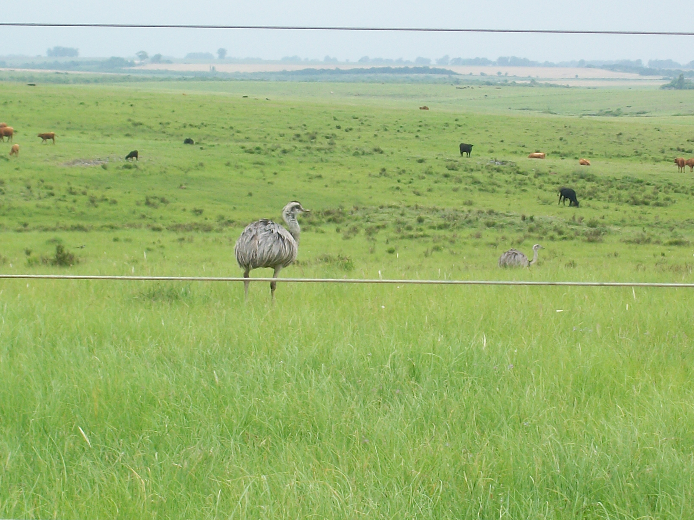

```{r setup, include=FALSE}
knitr::opts_chunk$set(echo = TRUE)
```


<!-- README.md is generated from README.Rmd. Please edit that file -->

<!-- badges: start -->
<!-- badges: end -->

### Spatial distribution of the Greater Rhea, *Rhea americana* (Linnaeus, 1758), in Rio Grande do Sul, southern Brazil: citizen-science data, probabilistic mapping, and comparison with expert knowledge


#### The paper can be accessed in the following link:

https://link.springer.com/article/10.1007/s43388-023-00143-3

#### You can find the app we used to get expert opinion in the following link:

https://andreluza.shinyapps.io/dashboardapp/?_ga=2.49360814.9824114.1608313240-1160325263.1601748869

#### DOI from GBIF dataset (Lacking in the main text):

GBIF.org (02 March 2020) GBIF Occurrence Download  https://doi.org/10.15468/dl.00u0bd

```{r include=T,echo=F, warning=F, fig.align='center', out.width="100%",out.height="100%"}
# All defaults



```
Picture taken by André Luza in Jaguarão, Rio Grande do Sul, 2013.


#### This paper was produced using the following software and associated packages:

```{r pressure, echo=F,warning=F,message=F}

source("R/packages.R")
sessionInfo()


```
