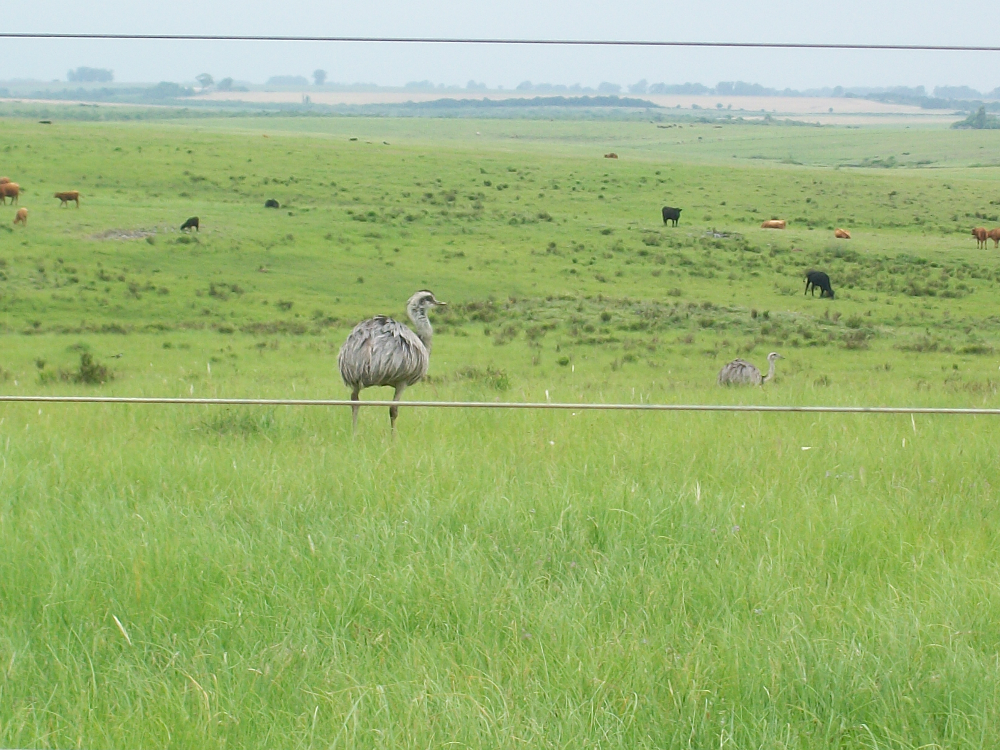

Greater Rhea project
================
AL Luza, AV Rodrigues, L Mamalis, V Zulian
2023-06-30

<!-- README.md is generated from README.Rmd. Please edit that file -->
<!-- badges: start -->
<!-- badges: end -->

Spatial distribution of the Greater Rhea, *Rhea americana* (Linnaeus,
1758), in Rio Grande do Sul, southern Brazil: citizen-science data,
probabilistic mapping, and comparison with expert knowledge

You can find the app we used to get expert opinion in the following
link:

<https://andreluza.shinyapps.io/dashboardapp/?_ga=2.49360814.9824114.1608313240-1160325263.1601748869>

